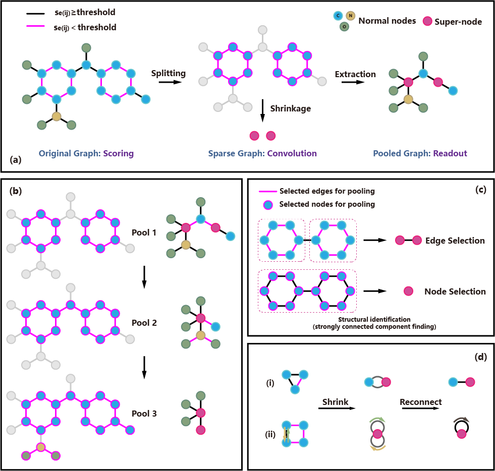

# MESPool: Molecular Edge Shrinkage Pooling for Hierarchical Molecular Representation Learning and Property Prediction

Fanding Xu, Zhiwei Yang, Lizhuo Wang, Deyu Meng and Jiangang Long



## Requirements

torch = 1.11.0

torch_geometric = 2.0.4

torch_scatter = 2.0.9

torch_sparse = 0.6.13

torchmetrics = 0.7.3

## Usage

There are three runnable Python scripts:


| File   | Description     |
| -------------- | ---- |
| **run_egin.py** | Run the benchmark test with EGIN framework. |
| **run_mes.py** | Run the benchmark test with MESPool framework. |
| **visual_demo.py** | Show the pooling result of a given molecule on the trained model. |

You can use -h or --help to list all the available parameters in the scripts and their explanations, e.g:

```cmd
python run_mes.py -h
```

All parameters in **run_egin.py** and **run_mes.py** have default settings, you can run them directly. The default benchmark dataset is BACE (also for **visual_demo.py**). You can change the task (dataset) by setting --dataset, e.g:

```cmd
python run_mes.py --dataset bbbp
```

The available dataset options include: ['bbbp', 'bace', 'clintox', 'hiv', 'tox21', 'esol', 'freesolv', 'lipo', 'muv', 'sider', 'covid', 'muta'].

**Notice:** Before you start the benchmark test, please make sure the dataset has been put in ./datasets. You can download the benchmark we used in this work at https://deepchemdata.s3-us-west-1.amazonaws.com/datasets/BBBP.csv (replace the BBBP in the hyperlink with another dataset name to download other datasets).

**visual_demo.py** requires the SMILES and the name of molecule to be tested (the name is used for setting the file name of the pooling result image), e.g:

```cmd
python visual_demo.py --smiles N1(C)C2=C(N(C)C(=O)N(C)C2=O)N=C1 --name Caffeine
```

If you have any questions, you can discuss with us in **[Issues](https://github.com/xfd997700/MESPool/issues)**.

